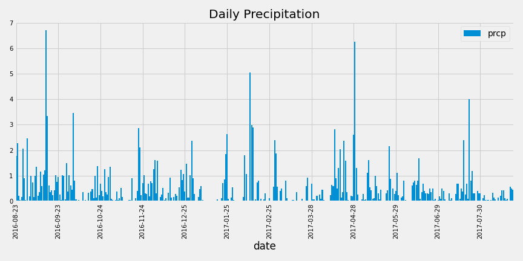
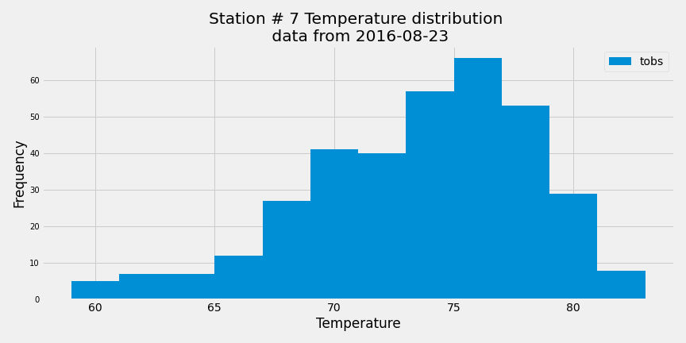
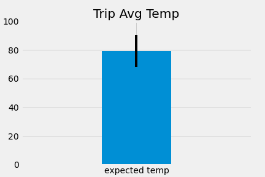

# sqlalchemy-challenge

sqlalchemy Homework - Climate API 

code is PythonCode directory

data|	prcp
---|    ---
count|	2021.000000
mean|	0.177279
std|    0.461190
min|	0.000000
25%|    0.000000
50%|	0.020000
75%|	0.130000
max|	6.700000

Analysis

### 1. Data is not normally distributed - we do not meet conditions for both t-test
### 2. The observations are sampled independently - well it is not - so we do not meet another requirement for t-test
### 3. unpaired t-test should be used to compare the mean between two independent groups - dec and jun are independent
### 4. t-test null hypotheisis states that samples are equal,  p-value is very low 
### 5. this indicates than we can reject null hypothesis as statistically insignificant 
## so bottom line - bad example 
## but t-tets shows significant difference between the two groups of data